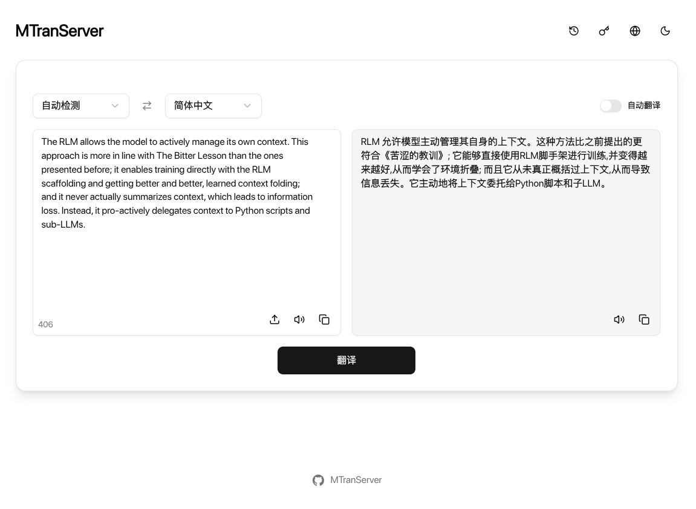
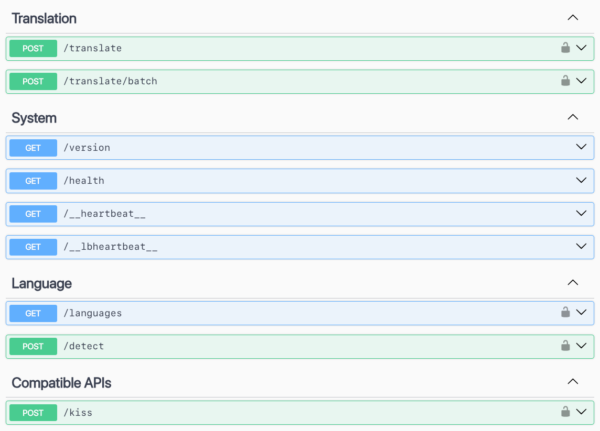

# MTranServer

[中文](../README.md) | [English](README_en.md) | [日本語](README_ja.md) | [Français](README_fr.md) | [Deutsch](README_de.md)

Ein ultraschneller Offline-Übersetzungsmodell-Server mit minimalem Ressourcenverbrauch. Keine Grafikkarte erforderlich. Durchschnittliche Antwortzeit von 50 ms pro Anfrage. Unterstützt die Übersetzung der weltweit wichtigsten Sprachen.

Beachten Sie, dass dieser Modellserver auf die Designziele `Offline-Übersetzung`, `Reaktionsgeschwindigkeit`, `plattformübergreifende Bereitstellung` und `lokale Ausführung` fokussiert ist, um `unbegrenzte kostenlose Übersetzungen` zu erreichen. Aufgrund von Einschränkungen bei der Modellgröße und Optimierung wird die Übersetzungsqualität sicherlich nicht so gut sein wie die von großen Sprachmodellen. Für qualitativ hochwertige Übersetzungen wird die Verwendung von Online-APIs für große Sprachmodelle empfohlen.

> v4 hat den Speicherverbrauch optimiert, die Geschwindigkeit weiter erhöht und die Stabilität verbessert. Wenn Sie eine alte Version verwenden, wird ein sofortiges Upgrade empfohlen!


## Online Demo

| Website                                                                      | TOKEN                     | Andere Schnittstelle                                                                    | Anbieter                             |
| ---------------------------------------------------------------------------- | ------------------------- | --------------------------------------------------------------------------------------- | ------------------------------------ |
| [ipacel.cc](https://MTranServer.ipacel.cc/ui/?token=__IpacEL_MT_API_TOKEN__) | `__IpacEL_MT_API_TOKEN__` | Immersive Translate: `https://MTranServer.ipacel.cc/imme?token=__IpacEL_MT_API_TOKEN__` | [@ApliNi](https://github.com/ApliNi) |

Vielen Dank an die Mitwirkenden der Community für die Bereitstellung von Testdiensten für Benutzer!

## Gebrauchsanweisung

Unterstützt jetzt Desktop-Ein-Klick-Start! Unterstützt Windows, Mac und Linux.

### Desktop-App

#### Manueller Download

Laden Sie die neueste Desktop-Version für Ihre Plattform von [Releases](https://github.com/xxnuo/MTranServer/releases) herunter, installieren und starten Sie direkt.

Nach dem Start der Desktop-App wird ein Tray-Menü erstellt, über das Sie den Dienst bequem verwalten können.

Das Programm enthält eine einfache Benutzeroberfläche und Online-Debug-Dokumentation.

Detaillierte Gebrauchsanweisungen finden Sie unter [Ökosystem-Projekte](#Ökosystem-Projekte)

Vorschau (in der neuesten Version aktualisiert):





### Server

Es wird empfohlen, die Desktop-App oder Docker-Bereitstellung zu verwenden, da diese bessere Leistung und einfachere Bedienung bieten. Die manuelle Server-Bereitstellung ist für fortgeschrittene Benutzer gedacht.

#### Schnellstart

Programmierer können den Server direkt über die Befehlszeile starten:

```bash
npx mtranserver@latest
```

> `npx` kann durch einen beliebigen Paketmanager ersetzt werden, z. B. `bunx`, `pnpx` usw.

> **Wichtiger Hinweis:**
>
> Bei der erstmaligen Übersetzung eines Sprachpaares lädt der Server automatisch das entsprechende Übersetzungsmodell herunter (sofern der Offline-Modus nicht aktiviert ist). Dieser Vorgang kann je nach Netzwerkgeschwindigkeit und Modellgröße einige Zeit in Anspruch nehmen. Nach dem Herunterladen des Modells profitieren nachfolgende Übersetzungsanfragen von einer Antwortzeit im Millisekundenbereich. Es wird empfohlen, vor der eigentlichen Verwendung eine Übersetzung zu testen, damit der Server das Modell vorab herunterladen und laden kann. Das Programm wird häufig aktualisiert. Wenn Sie auf Probleme stoßen, versuchen Sie, auf die neueste Version zu aktualisieren.

#### Schnellinstallation

```bash
npm i -g mtranserver@latest
```

> `npm` kann durch einen beliebigen Paketmanager ersetzt werden, z. B. `bun`, `pnpm` usw.

Starten Sie anschließend `mtranserver`.

#### Docker Compose Bereitstellung

Erstellen Sie ein leeres Verzeichnis und darin eine `compose.yml` Datei mit folgendem Inhalt:

```yml
services:
  mtranserver:
    image: xxnuo/mtranserver:latest
    container_name: mtranserver
    restart: unless-stopped
    ports:
      - "8989:8989"
    environment:
      - MT_HOST=0.0.0.0
      - MT_PORT=8989
      - MT_OFFLINE=false
      # - MT_API_TOKEN=ihr_geheimer_token_hier
    volumes:
      - ./models:/app/models
```

```bash
docker pull xxnuo/mtranserver:latest
docker compose up -d
```

## Ökosystem-Projekte

### IDE-Plugins

#### [MTranCode](https://github.com/xxnuo/MTranCode) Kommentar-Übersetzungs-Plugin

Unterstützt VS Code, Cursor, Augment und andere VS-Code-basierte IDEs.

Suchen Sie im Plugin-Marktplatz nach **`MTranCode`**, um das Kommentar-Übersetzungs-Plugin zu installieren.

Das Plugin ruft standardmäßig den Server unter `http://localhost:8989` für Kommentar- und Code-Übersetzungen auf. Sie können dies in den Einstellungen anpassen.

Dieses Plugin ist ein Fork von [vscode-comment-translate](https://github.com/intellism/vscode-comment-translate).

### Browser-Erweiterung

#### [MTranBrowser](https://github.com/xxnuo/MTranBrowser)

TODO: In aktiver Entwicklung.

> Wenn Sie ein abgeleitetes Projekt entwickeln, können Sie gerne eine PR einreichen. Ich füge Ihr Projekt zur Ökosystem-Liste hinzu.
>
> Übrigens wurde das Projekt auf npm veröffentlicht. Sie können die einfache Bibliotheksschnittstelle direkt in anderen Programmen aufrufen, um Übersetzungsfunktionen zu implementieren. Weitere Informationen finden Sie in den TypeScript-Typdefinitionen.

## Kompatible Schnittstellen

Der Server bietet kompatible Schnittstellen für mehrere Übersetzungs-Plugins:

| Schnittstelle                   | Methode | Beschreibung                                       | Unterstützte Plugins                                                                    |
| ------------------------------- | ------- | -------------------------------------------------- | --------------------------------------------------------------------------------------- |
| `/imme`                         | POST    | Schnittstelle für Immersive Translate Plugin       | [Immersive Translate](https://immersivetranslate.com/)                                  |
| `/kiss`                         | POST    | Schnittstelle für Kiss Translator Plugin           | [Kiss Translator](https://github.com/fishjar/kiss-translator)                           |
| `/deepl`                        | POST    | DeepL API v2 kompatible Schnittstelle              | Clients, die die DeepL API unterstützen                                                 |
| `/deeplx`                       | POST    | DeepLX kompatible Schnittstelle                    | Clients, die die DeepLX API unterstützen                                                |
| `/hcfy`                         | POST    | Selection Translator kompatible Schnittstelle      | [Selection Translator](https://github.com/Selection-Translator/crx-selection-translate) |
| `/hcfy`                         | POST    | Selection Translator kompatible Schnittstelle      | [Selection Translator](https://github.com/Selection-Translator/crx-selection-translate) |
| `/google/language/translate/v2` | POST    | Google Translate API v2 kompatible Schnittstelle   | Clients, die die Google Translate API unterstützen                                      |
| `/google/translate_a/single`    | GET     | Google translate_a/single kompatible Schnittstelle | Clients, die Google Web Translate unterstützen                                          |

**Plugin-Konfigurationsanleitung:**

> Hinweis:
>
> - [Immersive Translate](https://immersivetranslate.com/docs/services/custom/): Aktivieren Sie im Entwicklermodus auf der Seite `Einstellungen` die `Beta`-Funktionen, dann sehen Sie unter `Übersetzungsdienste` die `Benutzerdefinierte API-Einstellungen` ([offizielles Tutorial mit Bildern](https://immersivetranslate.com/docs/services/custom/)). Erhöhen Sie dann die `Maximale Anfragen pro Sekunde` in den `Benutzerdefinierte API-Einstellungen`, um die Serverleistung voll auszuschöpfen. Ich habe `Maximale Anfragen pro Sekunde` auf `512` und `Maximale Absätze pro Anfrage` auf `1` eingestellt. Sie können dies entsprechend Ihrer Serverkonfiguration anpassen.
>
> - [Kiss Translator](https://github.com/fishjar/kiss-translator): Scrollen Sie auf der Seite `Einstellungen` nach unten zu den Schnittstelleneinstellungen, dort sehen Sie die benutzerdefinierte Schnittstelle `Custom`. Stellen Sie ebenfalls die `Maximale Anzahl gleichzeitiger Anfragen` und das `Anfrageintervall` ein, um die Serverleistung voll auszuschöpfen. Ich habe die `Maximale Anzahl gleichzeitiger Anfragen` auf `100` und das `Anfrageintervall` auf `1` eingestellt. Sie können dies entsprechend Ihrer Serverkonfiguration anpassen.
>
> Konfigurieren Sie anschließend die Adresse der benutzerdefinierten Schnittstelle des Plugins gemäß der untenstehenden Tabelle.

| Name                                | URL                                                  | Plugin-Einstellung                                                                      |
| ----------------------------------- | ---------------------------------------------------- | --------------------------------------------------------------------------------------- |
| Immersive Translate (Ohne Passwort) | `http://localhost:8989/imme`                         | `Benutzerdefinierte API-Einstellungen` - `API-URL`                                      |
| Immersive Translate (Mit Passwort)  | `http://localhost:8989/imme?token=your_token`        | Dasselbe wie oben, ändern Sie `your_token` am Ende der URL in Ihren `MT_API_TOKEN` Wert |
| Kiss Translator (Ohne Passwort)     | `http://localhost:8989/kiss`                         | `Schnittstelleneinstellungen` - `Custom` - `URL`                                        |
| Kiss Translator (Mit Passwort)      | `http://localhost:8989/kiss`                         | Dasselbe wie oben, füllen Sie `KEY` mit `your_token` aus                                |
| DeepL Kompatibel                    | `http://localhost:8989/deepl`                        | Verwenden Sie `DeepL-Auth-Key` oder `Bearer` Authentifizierung                          |
| DeepLX Kompatibel                   | `http://localhost:8989/deeplx`                       | Unterstützt `token` Parameter oder `Bearer` Authentifizierung                           |
| Google Kompatibel                   | `http://localhost:8989/google/language/translate/v2` | Verwenden Sie den `key` Parameter oder `Bearer` Authentifizierung                       |
| Selection Translator                | `http://localhost:8989/hcfy`                         | Unterstützt `token` Parameter oder `Bearer` Authentifizierung                           |

**Normale Benutzer können den Dienst nutzen, indem sie die Schnittstellenadresse des Plugins gemäß dem Tabelleninhalt konfigurieren.**

### Befehlszeilenparameter

```bash
./mtranserver [Optionen]

Optionen:
  -version, -v          Versionsinformationen anzeigen
  -log-level string     Protokollierungsgrad (debug, info, warn, error) (Standard "warn")
  -config-dir string    Konfigurationsverzeichnis (Standard "~/.config/mtran/server")
  -model-dir string     Modellverzeichnis (Standard "~/.config/mtran/models")
  -host string          Server-Abhöradresse (Standard "0.0.0.0")
  -port string          Server-Port (Standard "8989")
  -ui                   Web-UI aktivieren (Standard true)
  -offline              Offline-Modus aktivieren, neue Modelle nicht automatisch herunterladen (Standard false)
  -worker-idle-timeout int  Worker-Leerlauf-Timeout (Sekunden) (Standard 300)
  --download pairs...   Modelle für bestimmte Sprachpaare herunterladen (z. B. --download en_zh zh_en)
  --languages           Alle unterstützten Sprachpaare zum Download auflisten

Hinweis: `--download` und `--languages` benötigen eine Netzwerkverbindung und funktionieren nicht im Offline-Modus.

Beispiele:
  ./mtranserver --host 127.0.0.1 --port 8080
  ./mtranserver --ui --offline
  ./mtranserver -v
```

## Ähnliche Projekte

Hier sind einige Projekte mit ähnlichen Funktionen. Wenn Sie andere Bedürfnisse haben, können Sie diese Projekte ausprobieren:

| Projektname                                                        | Speicherverbrauch | Nebenläufigkeitsleistung | Übersetzungsqualität | Geschwindigkeit | Weitere Informationen                                                                                                                                                          |
| ------------------------------------------------------------------ | ----------------- | ------------------------ | -------------------- | --------------- | ------------------------------------------------------------------------------------------------------------------------------------------------------------------------------ |
| [NLLB](https://github.com/facebookresearch/fairseq/tree/nllb)      | Sehr hoch         | Schlecht                 | Durchschnittlich     | Langsam         | Die Android-Portierung [RTranslator](https://github.com/niedev/RTranslator) hat viele Optimierungen, aber der Ressourcenverbrauch ist immer noch hoch und es ist nicht schnell |
| [LibreTranslate](https://github.com/LibreTranslate/LibreTranslate) | Sehr hoch         | Durchschnittlich         | Durchschnittlich     | Mittel          | Mittelklasse-CPU verarbeitet 3 Sätze/s, High-End-CPU 15-20 Sätze/s. [Details](https://community.libretranslate.com/t/performance-benchmark-data/486)                           |
| [OPUS-MT](https://github.com/OpenNMT/CTranslate2#benchmarks)       | Hoch              | Durchschnittlich         | Eher schlecht        | Schnell         | [Leistungstests](https://github.com/OpenNMT/CTranslate2#benchmarks)                                                                                                            |
| Andere große Modelle                                               | Extrem hoch       | Dynamisch                | Sehr gut             | Sehr langsam    | Hohe Hardwareanforderungen. Wenn Sie eine Übersetzung mit hoher Nebenläufigkeit benötigen, wird empfohlen, das vllm-Framework zu verwenden.                                    |
| Dieses Projekt                                                     | Niedrig           | Hoch                     | Durchschnittlich     | Extrem schnell  | Durchschnittliche Antwortzeit von 50 ms pro Anfrage.                                                                                                                           |

> Die Daten in der Tabelle beziehen sich auf einfache Tests mit CPU, Englisch-Chinesisch-Szenarien, keine strengen Tests, Vergleich von nicht quantisierten Versionen, nur als Referenz.

# Erweiterte Konfigurationsanleitung

Bitte beachten Sie die Datei [API_de.md](API_de.md) und die API-Dokumentation nach dem Start.

## Star History

[](https://www.star-history.com/#xxnuo/MTranServer&Timeline)

## Thanks

[Bergamot Project](https://browser.mt/) for awesome idea of local translation.

[Mozilla](https://github.com/mozilla) for the [models](https://github.com/mozilla/firefox-translations-models).
